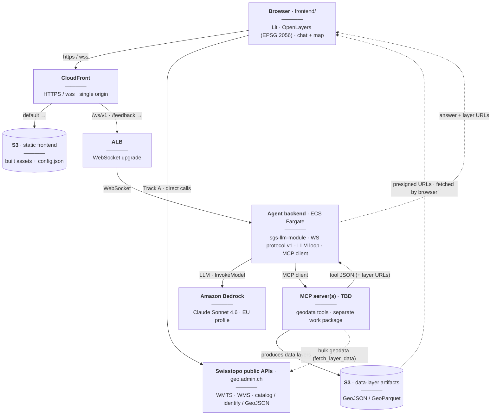

# Architecture

## System diagram

The whole system in one picture. The browser runs the frontend, served via
**CloudFront** from **S3**, and works two ways at once: **[Track A](#overview)**
calls the Swisstopo public APIs directly for the catalog, tiles, and identify;
**[Track B](#overview)** speaks WebSocket protocol v1 through CloudFront and an
**ALB** to the agent backend on **ECS Fargate**. The backend runs the LLM loop
on **Amazon Bedrock** and calls the geodata **MCP server** (still TBD), which
produces the result **data layers** in S3; the backend relays their presigned
URLs to the browser, which fetches them. The backend host is the target (ECS
Fargate behind an ALB); the pilot initially runs the bundled mock-agent on EC2
(see [`deployment.md`](./deployment.md#backend-deployment)).



## Overview

The SGS LLM prototype is a chat + web map application for Swiss federal
geodata. This phase implements the **frontend work package**; the agent
backend (LLM orchestration, MCP client) is developed separately and connects
over the WebSocket protocol described in [protocol.md](./protocol.md).

```text
┌─────────────────────────────────────────────────────────────┐
│ Frontend (this repo, frontend/)                             │
│   Lit 3 + TypeScript + Vite                                 │
│   OpenLayers map (EPSG:2056) · @swissgeol/ui-core           │
│                                                             │
│   ├── direct Swisstopo API calls (catalog, identify,        │
│   │   legends, layersConfig, WMTS/WMS tiles, GeoJSON)       │
│   └── WebSocket /ws/v1 ──► Agent backend (askEarth, later)  │
│                            └─ mock-agent/ in development    │
└─────────────────────────────────────────────────────────────┘
```

Two tracks make the app dynamic before the agent backend exists:

- **Track A — direct Swisstopo interactivity.** Browse the official catalog
  tree (CatalogServer) with a client-side filter and translated topic names,
  add any displayable catalog layer (WMTS, WMS, or GeoJSON — only genuinely
  non-displayable entries are greyed out), open per-layer information
  dialogs, identify-on-click (MapServer identify), and per-layer legends
  shown automatically in a top-right map overlay — all against the public
  `api3.geo.admin.ch` / `wmts.geo.admin.ch` / `wms.geo.admin.ch` /
  `data.geo.admin.ch` services.
- **Track B — chat against the protocol.** The chat panel speaks protocol
  v1 to a configurable WebSocket endpoint. The bundled `mock-agent/` is the
  executable reference implementation, streaming progress events, markdown
  answers, and data layers.

## Stack decisions

| Decision | Rationale |
| --- | --- |
| Lit 3 web components | Consistency with swissgeol-viewer-suite (the swissgeol.ch flagship); first-class fit with the shared design system |
| OpenLayers | The 2D engine proven in swissgeol-assets-suite with Swisstopo services |
| Swiss LV95 projection (EPSG:2056) | The map view, all sources, and identify run in the native Swiss CRS, like map.geo.admin.ch / SwissGeo. The swisstopo LV95 tile grid is a rectangle fully covered by map data, so the basemap renders cleanly (in Web Mercator the Swiss-only coverage appears as a skewed frame in a void). See "Map projection and zoom ladder" below |
| @swissgeol/ui-core | Provides the SwissGeo family's Inter font and design-system conventions. Our palette is defined as `--sgc-*` tokens in `frontend/src/style/theme.css` (single source of truth; components reference the vars without per-rule fallbacks) |
| RxJS services + @lit/context | Service classes own state as `BehaviorSubject`s, provided via context; `ObservableController` bridges emissions into Lit re-renders |
| SwissGeo-style shell | Left icon rail (chat, displayed maps, geocatalog, feedback, about) opening one flyout panel at a time, sliding in as an animated overlay over the map; the panel is drag-resizable at its right edge (width persisted in localStorage); language selector at the rail bottom — mirrors viewer.swissgeo |
| SwissGeo-style map controls | Custom bottom-right cluster (geolocation above a zoom bar) instead of the small OpenLayers default zoom control; geolocation transforms to LV95 with a Swiss-bounds check |
| Official geocatalog | Topic list (translated names, `ech` pinned first) + per-topic catalog tree from the Swisstopo CatalogServer API (cached per topic and language); per-layer presentation overrides in `layers/layers_wmts.json5` |
| i18next, German fallback | de/fr/it/en/rm; the active language is passed to every Swisstopo API call and WS message |
| marked + DOMPurify | Agent markdown and Swisstopo legend fragments are sanitized with DOMPurify (a shared hook forces sanitized links to open in a new tab with `rel="noopener noreferrer"`); the richer identify htmlPopup renders only in a sandboxed iframe |

## Map projection and zoom ladder (LV95)

The whole map pipeline runs in **EPSG:2056** (registered via proj4 at
startup, `frontend/src/lib/projection.ts`). `frontend/src/map/swissGrid.ts`
holds the swisstopo LV95 tile grid (origin `[2420000, 1350000]`, extent
`[2420000, 1030000, 2900000, 1350000]`, 29 resolutions from the official
WMTS capabilities) shared by all WMTS sources, plus the view's zoom ladder.

The view snaps to the official ladder (650 → 0.25 m/px,
`constrainResolution`), so tiles always render 1:1 at a real swisstopo zoom
level — the zoomed-out levels carry the light generalized national-map style
(with the neighboring countries), the deeper levels the detailed styles.
The view's extent constraint is center-only: users can zoom out far enough
to see the whole tile grid, but cannot pan the center off it. Everything
that crosses a projection boundary is explicit: agent bboxes are WGS84 and
transformed at the `MapService` camera methods; chat/official GeoJSON is
reprojected on read (official files declare their CRS, usually EPSG:2056);
identify runs with `sr=2056`; the coordinate readout is the map coordinate.

## Light DOM exceptions

`<sgs-app>` and `<sgs-map>` render in light DOM because `ol/ol.css` is a
document-level stylesheet that cannot style inside shadow roots (map
controls, attribution, overlay positioning). Their layout styles live in
`frontend/src/style/global.css`. Everything else uses shadow DOM; ui-core
custom properties inherit through.

## Services

| Service | Responsibility |
| --- | --- |
| `MapService` | Owns the single `ol/Map`: LV95 view on the official zoom ladder, basemaps (WMTS from layersConfig), camera (fitBBox / fitLV95Extent / zoomBy), click stream, identify highlight layer, geolocation marker |
| `LayerService` | Active layers (official WMTS/WMS/GeoJSON overlays + chat data layers): add/remove, visibility, opacity, order (buttons and drag-and-drop via `moveLayerToIndex`), zoom-to (data-layer bbox or vector source extent), periodic refresh of live GeoJSON layers |
| `CatalogService` | layersConfig cache per language, geocatalog topics/trees (CatalogServer) |
| `UiService` | Shell state: which rail flyout panel is open; the layer-info dialog request |
| `ChatService` | Chat state machine over `AgentClient` events (progress steps, markdown, layers, errors, cancel) |
| `AgentClient` | WebSocket lifecycle: exponential-backoff reconnect, frame parsing with forward-compatible guards |

## Data layers from chat

`LayerSpec.format` currently supports `geojson` end-to-end. `parquet`
(GeoParquet via presigned URLs, as planned for the production agent) is
stable in the protocol but renders as a "format not yet supported" notice.
Follow-up path: `parquet-wasm` → Arrow → GeoJSON features into the same
`VectorSource` behind `LayerService.addDataLayer`'s format switch — no
protocol change required.

## Backend architecture

The chat side is served by the agent backend, developed separately in
[`swisstopo/sgs-llm-module`](https://github.com/swisstopo/sgs-llm-module) and
connected over the WebSocket protocol; the notes below record the **design
decisions** for that backend. How the service is deployed is in
[`deployment.md`](./deployment.md#backend-deployment); the client side of the
geodata tool interface is in [MCP client interface](#mcp-client-interface).

```text
┌──────────────────────────────────────────────────────────────────┐
│ Agent backend (sgs-llm-module)                                     │
│   Dockerized Python service · WebSocket protocol v1 (stateless)    │
│                                                                    │
│   /ws/v1 ◄──► agent orchestrator (LLM loop)                        │
│                 ├─ LLM ──► Amazon Bedrock — Claude                 │
│                 │          (eu.anthropic.* EU inference profile)   │
│                 └─ MCP client ──► MCP server(s): geodata tools,    │
│                                   fetch_layer_data  (separate)     │
│                                                                    │
│   data layers ──► GeoJSON / GeoParquet on S3 (presigned URLs)      │
└──────────────────────────────────────────────────────────────────┘
```

- **Stateless protocol v1** — the backend receives the full conversation history and map context on every turn (see [protocol.md](./protocol.md)), so it can restart or scale freely; versioning at the URL (`/ws/v1`) lets it release independently of the frontend.
- **MCP client + LLM orchestrator** — the backend runs the LLM loop and the MCP client that calls the geodata tools; the MCP **server** is a separate component (see [Swisstopo connector](#swisstopo-connector)).
- **Amazon Bedrock, Claude via the EU inference profile** (`eu.anthropic.claude-*`) — managed, IAM-authenticated model access that stays within EU regions, with no API key to store; model choice in [`llm.md`](./llm.md).
- **Agent loop → protocol events** — tool and LLM progress stream as `intermediate`, the answer and data layers as `final`, turn completion as `done`, and a client `cancel` aborts the in-flight turn.
- **Data layers on S3** — results are written by the MCP Server as GeoJSON / GeoParquet and returned as presigned URLs in `LayerSpec` (see [Data layers from chat](#data-layers-from-chat)).

## MCP client interface

The backend is the **MCP client**; the geodata tools live on a separate MCP
**server** (the connector). This section fixes the **client side**
so backend work can proceed.

Client side:

- **Transport** — connect to the server over **Streamable HTTP** (remote MCP), not stdio: `initialize`, cache `tools/list`, invoke with `tools/call`.
- **In the agent loop** — the server's tools are offered to Claude as its tool set; each model `tool_use` becomes a `tools/call`, and the result is fed back until the model produces the final answer.
- **Mapping to protocol v1** — the client converts tool output into the frontend's events: a fetchable GeoJSON/GeoParquet URL with a WGS84 `bbox` (and optional style hint) becomes a `LayerSpec`; tool progress streams as `intermediate`; a client `cancel` aborts the in-flight `tools/call`; failures surface as `error`.
- **Auth & secrets** — the client presents the server's credential (bearer token / OAuth) from Secrets Manager; the server endpoint must be reachable from the Fargate task's egress.

Needed from the server:

- The **endpoint URL**, and confirmation of **Streamable HTTP** transport and the **auth scheme**.
- The **tool catalog** — each tool's name and JSON-Schema input/output.
- For any tool that produces a map layer, a result that yields a **fetchable GeoJSON or GeoParquet URL plus a WGS84 bounding box** (and any style hint), so the client can build a `LayerSpec` without re-hosting the data.
- **Limits** — payload sizes, rate limits, and timeout / long-running behavior.

## Swisstopo connector

All Swisstopo access lives in `frontend/src/swisstopo/` — thin, typed
wrappers over the public geo.admin.ch APIs
([docs.geo.admin.ch](https://docs.geo.admin.ch/)), sharing one HTTP helper
(`http.ts`: 15 s timeout + caller `AbortSignal`). No offline preprocessing;
everything is queried live and cached in memory.

| Endpoint | Module | Limits honored |
| --- | --- | --- |
| `{topic}/CatalogServer` + topics | `catalogApi.ts` | promise-cached per topic + language; non-`prod` staging entries dropped |
| `MapServer/identify` | `identifyApi.ts` | `sr=2056`; `limit=200` (API max; default 50, applied per underlying table); `geometryFormat=geojson` (avoids ESRI-JSON conversion); superseded clicks aborted |
| `MapServer/layersConfig` | `layersConfigApi.ts` | ~1 MB per language, promise-cached per language with retry-on-failure; carries the per-layer service parameters (WMTS format/timestamps, WMS endpoint/params, GeoJSON data/style URLs) |
| `MapServer/{layer}/legend` | `legendApi.ts` | untrusted HTML, DOMPurify-sanitized; rendered inline in the map legend overlay and as the body of the layer-info dialog |
| `MapServer/.../htmlPopup` | `identifyApi.ts` | untrusted HTML, rendered only inside a `sandbox=""` iframe |
| `wmts.geo.admin.ch` XYZ tiles | `wmts.ts` | LV95 (`/2056/`) tile template; format/timestamp always resolved from layersConfig; sources share the grid from `map/swissGrid.ts` |
| `wms.geo.admin.ch` GetMap | `wms.ts` | LAYERS/FORMAT from layersConfig; `singleTile` layers use one viewport-sized image (`ImageWMS`), tiled layers use `TileWMS` with the layer's `gutter`; CRS follows the view (EPSG:2056); TIME is not sent (server default) |
| `data.geo.admin.ch` GeoJSON + `api3` vector styles | `geojsonStyle.ts` (+ `LayerService`) | features reprojected from the file's declared CRS; the geoadmin style JSON (`unique`/`range`/`single` rules, resolution windows, markers, label templates) is parsed into an OL style function with a safe default fallback; layers with `updateDelay` re-fetch periodically while on the map |

**Deliberately not used by the frontend** (bulk-data concerns owned by the
future MCP server's `fetch_layer_data`, per the project design): the
`SearchServer` (location / layer / feature search — the geocatalog browses
the CatalogServer tree and filters it client-side instead), identify
`offset` paging, grid splitting + cross-cell deduplication, rate limiting of
fan-out requests, the STAC download API, and `layerDefs` attribute filtering
(supported on 11 queryable layers only). A click identify (point + pixel
tolerance feeding a popup) never needs more than one page, and identify has
no order parameter.

## Runtime configuration

Vite environment variables are build-time; the agent WebSocket URL and the
feedback endpoint must be deploy-time. The app loads `/config.json` at
startup (`frontend/public/config.json` → `{ agentWsUrl, feedbackUrl }`,
served with `Cache-Control: no-store` by the bundled nginx config) — replace
it in the deployment to point at the real agent backend and feedback
service. All Swisstopo API base URLs live in `frontend/src/config.ts` so a
proxy can be slotted in if needed (the public APIs allow cross-origin
requests today, but that is operational behavior, not a contract).

## Security notes

- Agent markdown and Swisstopo legend fragments: untrusted HTML sanitized with
  DOMPurify (scripts/styles/iframes stripped); a shared hook
  (`markdown/purifyLinkHook.ts`) forces every sanitized anchor to
  `target="_blank" rel="noopener noreferrer"`. The sanitized legend renders
  inline in the map legend overlay and in the layer-info dialog.
- Swisstopo identify `htmlPopup`: richer untrusted HTML, rendered exclusively
  inside a `sandbox=""` iframe.
- Geolocation: browser API only, used on demand for the locate button; the
  position is never sent anywhere.
- No authentication, no user data storage (public prototype, by design).

## Testing

`vitest` (node environment) covers the logic surface: protocol guards,
AgentClient state machine, ChatService reducer, catalog parsing/merging,
style mapping (chat style hints and the geoadmin vector-style parser),
projection helpers, layer ordering/zoom/refresh logic in `LayerService`, and
API wrappers with mocked fetch. The markdown renderer and the legend
sanitizer run under jsdom (DOMPurify needs a DOM). Lit component DOM tests are
deliberately out of scope for the POC: ui-core's Stencil elements need a
real browser registry; the upgrade path is vitest browser mode +
`@open-wc/testing`.

## Demo script (manual verification)

1. `cd mock-agent && npm start` and `cd frontend && npm run dev`
2. Initial map: all of Switzerland in the light national-map style; zoom out
   once more to see the whole LV95 frame with the neighboring countries;
   zooming in two steps switches to the detailed map style
3. Rail → Chat: ask "Zeige mir Hochwasser im Wallis" → progress steps
   stream → markdown answer + layer card → "Auf Karte anzeigen" →
   polygons render, map zooms. The "+" button in the chat header clears the
   thread to start a new conversation
4. Rail → Geocatalog: pick a topic (translated names), filter, add layers of
   each kind — a WMTS overlay (e.g. Wildruhezonen), a WMS layer (e.g. hail
   hazard), and a live GeoJSON layer (e.g. flood hazard levels: styled
   station icons with labels on zoom-in); the ⓘ button opens the layer-info
   dialog (description, legend, geocat/download links)
5. Rail → Displayed maps: switch Color/Grey/Aerial via the eye toggles;
   adjust layer opacity and visibility; reorder via the grip handle
   (drag-and-drop) or the arrow buttons; zoom-to-extent on vector layers.
   With more than five layers a performance hint appears. While a layer with
   a legend is visible, its legend shows automatically at the map's top-right
6. Drag the flyout's right edge to resize the panel (persists across
   reloads; double-click resets)
7. Bottom-right map controls: − / + step the zoom ladder; the locate button
   centers on your position with a marker (or reports out-of-Switzerland /
   denied access)
8. Click a feature of an identify-capable layer → popup with LV95 readout
9. Rail → Feedback: submit (entry lands in mock-agent/feedback.log)
10. Rail → About: project info panel
11. Switch the language via the rail's translate icon (de/fr/it/en/rm) →
    labels, catalog, and legends re-localize
12. Send a message containing `/error`, then one with `/slow` + cancel
13. Kill and restart the mock agent → connection badge recovers
